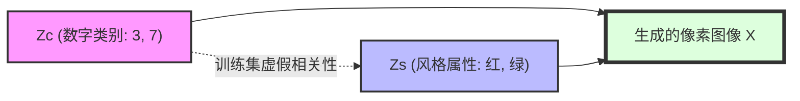
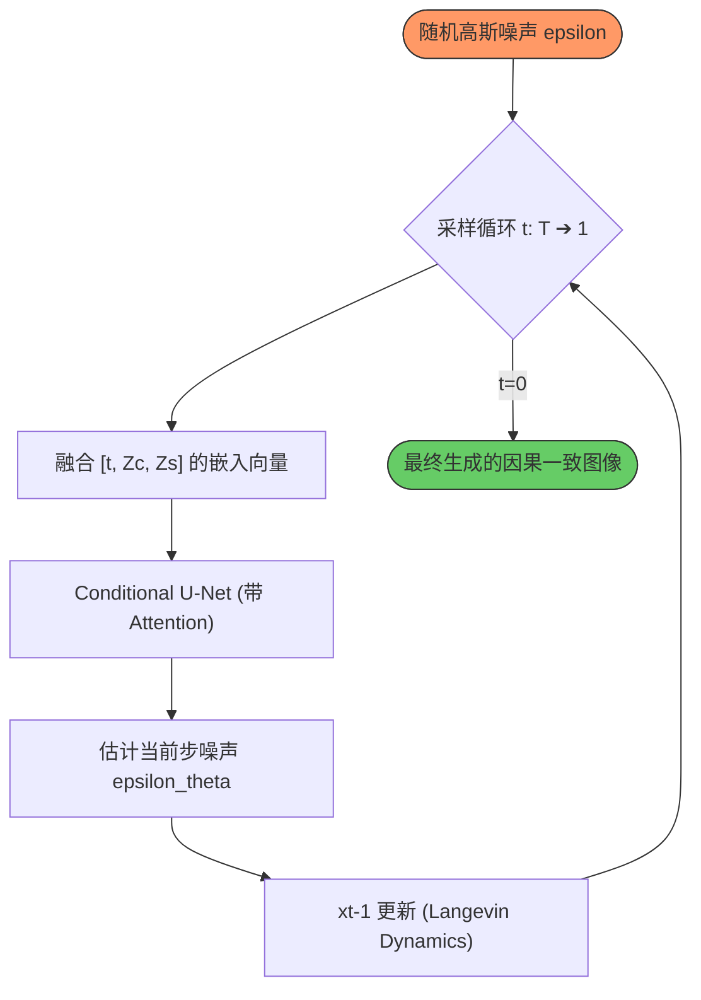

# 🧠 Structural Causal Diffusion (SCD) POC

[](https://www.python.org/)
[](https://pytorch.org/)
[](LICENSE)
[](https://developer.apple.com/metal/pytorch/)

> “当扩散模型拥有因果灵魂：通过解耦结构变量，实现对图像生成过程的极致控制与反事实干预。”

---

## 🌊 项目愿景 (Overview)

这是一个探索**因果推理 (Causal Inference)** 与 **扩散模型 (Diffusion Models)** 交集的实验性原型。传统条件生成模型往往会学习到数据中的**虚假相关性 (Spurious Correlations)**（如：在本项目训练集中，3 总是红色，7 总是绿色）。

**Causal Diffusion POC** 通过引入结构因果模型 (SCM)，将数字类别 ($Z_c$) 与风格属性 ($Z_s$) 解耦，使得模型能够执行 $do$-干预，从而实现：
1.  🛡️ **H1: 鲁棒性 (Robustness)**：在测试集分布偏移（OOD）的情况下，依然能忠实生成指令要求的数字和颜色。
2.  🔄 **H2: 反事实 (Counterfactuals)**：回答 *“如果这个现有的红 3 是一个 7，它会长什么样？”* 的问题。

---

## 📐 架构可视化 (Architecture)

### 1. 结构因果模型 (SCM)
项目底层的因果逻辑遵循以下有向无环图 (DAG)：



### 2. 因果引导的扩散采样流
在高斯扩散采样推理阶段，通过 $do(Z_c, Z_s)$ 显式指定因果变量。



---

## 🧪 深度模块解析 (Deep Dive)

### 🧠 `src/models.py`: 兼顾全局的 U-Net
模型基于改进的 U-Net，在瓶颈层（Bottleneck）集成了 **Self-Attention** 机制。这使得模型在处理局部颜色细节的同时，能够通过注意力机制维持数字的全局结构一致性。

### 🔢 `src/diffusion.py`: 噪声预测的因果化
不同于标准扩散模型只接受单一标签，我们的 `Diffusion` 类支持多维度条件。
*   **训练时**：监督模型在给定特定 $Z_c$ 和 $Z_s$ 下预测噪声。
*   **推理时**：通过自由组合 $Z_c$ 和 $Z_s$，实现对生成内容的解耦控制。

### 🎨 `src/create_dataset.py`: 模拟“偏见”环境
该脚本手动构造了一个极具挑战性的训练环境：
*   **训练集**：90% 的 3 是红色，90% 的 7 是绿色。
*   **测试集 (OOD)**：反转相关性，用于验证模型是否真的学会了因果关系，而非单纯的模板匹配。

---

## 🚀 极致快速上手 (Quickstart)

### 1. 环境准备
使用 Conda 创建纯净的实验环境：
```bash
conda env create -f environment.yml
conda activate causal-diffusion
```

### 2. 数据准备与训练
一键生成带偏置的数据并训练双模型（Baseline vs SCD）：
```bash
# 生成 Causal-MNIST 数据集
python src/create_dataset.py

# 同时训练基准模型与因果模型
python src/train.py
```

### 3. 因果干预评估
生成 robustness 报告与反事实对比图：
```bash
python src/evaluate.py
```

---

## 📊 生命周期与工作流 (Lifecycle)

1.  **数据初始化 (Abduction)**：创建模拟真实世界偏见的数据分布。
2.  **因果学习 (Action)**：在训练过程中通过显式标记 (Explicit Labeling) 强制模型学习解耦嵌入。
3.  **干预验证 (Prediction)**：
    *   **H1**: 验证模型在面对从未见过的“绿 3”时的生成能力。
    *   **H2**: 执行 $do(Z_c=7 | \text{Input is Red 3})$，观察风格迁移的纯净度。

---

## 🖼️ 结果概览 (Sneak Peek)

> [!TIP]
> 运行结束后，请查看 `results/` 目录：
> - `h1_robustness/`: 展示模型在 OOD 数据下的表现。
> - `h2_counterfactuals/`: **核心亮点**，对比 Baseline 与 SCD 在反事实生成上的显著差异。

---

> Built with ❤️ and 🧠 by **Antigravity** 🛸 | 探索 AI 的因果边界
